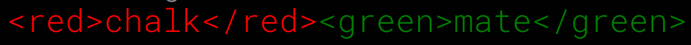
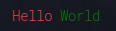

# chalk-mate
[](https://github.com/gitaumoses4/chalk-mate/actions)
[](https://app.codacy.com/gh/gitaumoses4/chalk-mate/dashboard?utm_source=gh&utm_medium=referral&utm_content=&utm_campaign=Badge_grade)
[](https://app.codacy.com/gh/gitaumoses4/chalk-mate/dashboard?utm_source=gh&utm_medium=referral&utm_content=&utm_campaign=Badge_coverage)
[](https://github.com/gitaumoses4/chalk-mate/issues)
[](https://github.com/gitaumoses4/chalk-mate/blob/master/LICENSE.md)

[](https://nodei.co/npm/chalk-mate/) <br />




A library that extends the [chalk.js](https://github.com/chalk/chalk) library by allowing you to apply color and style to HTML-like templates.

## Installation

```bash
npm install chalk-mate
```

## Usage

```javascript
import chalkMate from 'chalk-mate'

const styled = chalkMate(`<red>Hello</red> <green>World</green>`)

console.log(styled)
```

#### Output



## Foreground Color

The foreground color can be applied:
1. By using the color name as the tag name.
2. By using the `color` attribute.

### Color Names
CSS color names are supported. See [CSS Color Names](https://www.w3schools.com/colors/colors_names.asp) for a list of supported color names.

```html
<red>Hello World</red>
<text color="red">Hello World</text>
```

### Hexadecimal Color Codes

```html
<text color="#ff0000">Hello World</text>
```

### RGB Color Codes

```html
<text color="255, 0, 0">Hello World</text>
```

## Background Color

The background color can be applied:
1. By using the `bg-` prefix before the color name as the tag name.
2. By using the `bg` attribute.

### Color Names
CSS color names are supported. See [CSS Color Names](https://www.w3schools.com/colors/colors_names.asp) for a list of supported color names.

```html
<bg-red>Hello World</bg-red>
<text bg="red">Hello World</text>
```

### Hexadecimal Color Codes

```html
<white bg="#ff0000">Hello World</white>
```

### RGB Color Codes

```html
<white bg="255, 0, 0">Hello World</white>
```

## Text Styles

The following text styles are supported:
1. Bold
2. Dim
3. Italic
4. Underline
5. Inverse
6. Hidden
7. Strikethrough
8. Visible

> See modifiers in [chalk.js](https://github.com/chalk/chalk#modifiers) for more information.

They can be applied:
1. By using the style name as the tag name.
2. By using the name of the style as the attribute.

```html
<bold>Hello World</bold>
or
<text bold>Hello World</text>
```

```html
<italic>Hello World</italic>
or
<text italic>Hello World</text>
```

### Nesting

You can nest tags within tags.

```html
<red>Hello <bold>World</bold></red>
```

### Combining Styles and Colors

You can combine styles and colors.

```html
<bg-red color="white" underline>Hello <bold italic color="blue" bg="white">World</bold></bg-red>
```

# License (MIT)

Copyright &copy; Moses Gitau
All rights reserved.

Find a copy of the License [here](https://github.com/chalk-mate/blob/master/LICENSE.md)

<a href="https://www.buymeacoffee.com/gitaumoses4" target="_blank"></a>
